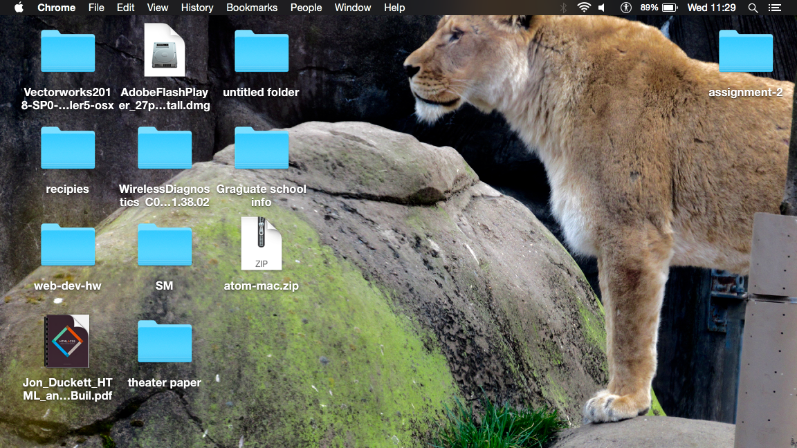
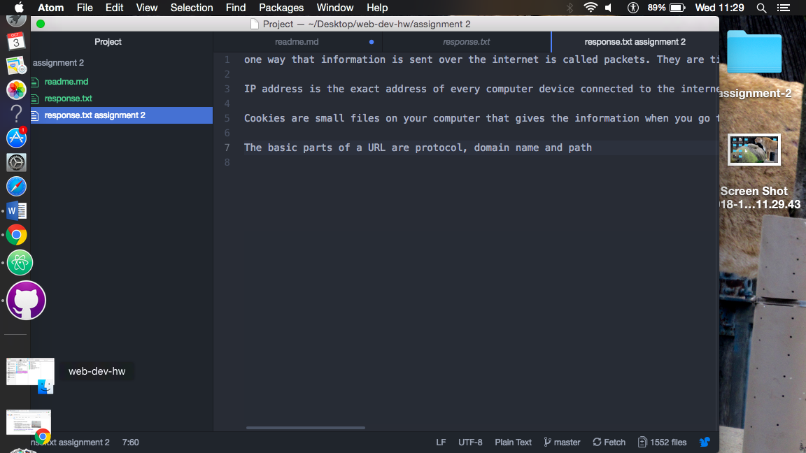

# README.md

version control systems are software tools that help a software team manage changes to a source code over time.
it keeps track of every change made to a code on a special database. version controlls help the teams solves problems which is why we use it in class.

[my responses](./responses.txt)

I am still trying to understand uploading the assignments but i will eventually get it figured out. I am still having issues with adding images on the website.

